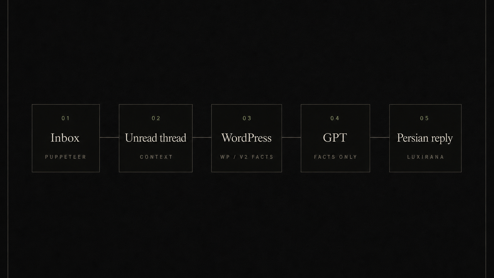

<p align="center">
  
</p>

<h1 align="center">Affiliate Instagram Bot</h1>

<p align="center">
  <em>Seylane personality. Luxirana inbox. Persian DMs.</em>
</p>

<p align="center">
  This repository stays <strong>affiliate-instagram-bot</strong>.<br>
  It is the Seylane affiliate Instagram bot for Luxirana — not a rename, not a new product.
</p>

---

The bot sits in the Luxirana Instagram inbox and talks like a human page admin. It recruits online shop owners into the Seylane Sabz affiliate program (`onlineshops`), answers in Persian, and will not invent product facts.

Product names, prices, and links come from the WordPress REST API on [luxirana.com](https://luxirana.com) (`wp/v2`). GPT may only restate what that payload contains.

## How a message moves

<p align="center">
  
</p>

Puppeteer (stealth) opens `instagram.com/direct/inbox`, keeps the unread threads, and processes **one** conversation at a time. If the message looks like a product question, `search_product.js` queries WordPress. GPT then writes a short Persian reply. Collaboration intent sends `https://luxirana.com` on its own line.

An Instagram Graph API client exists for webhooks and product cards. It is not the inbox loop.

## What it actually does

- Speaks as the Luxirana admin. Never admits it is a model.
- Assumes the other person runs an online shop, not a personal cart.
- Names six conversation brands: Misswake, Collamin, IceBall, Dafi, Umbrella, Pixel.
- Resolves WordPress brand IDs for Misswake (`2113`), Collamin (`2112`), and Comeon (`2110`). IceBall, Dafi, Umbrella, and Pixel have no brand ID in the search map.
- States consumer price and the 40% affiliate figure **only** when the shop asks for price.
- Deduplicates with `message_cache.json`. Keeps thread memory in `user_contexts.json`.
- Accepts message requests every 20 inbox loops.
- Runs a short self-test on startup (greeting, affiliate intent, tone).
- Starts an Express API in the same process (`PORT` → `API_PORT` → `3001`).
- Can pause / resume / stop from that API.
- Serves `/privacy` and `/terms` for Meta App Review.

The Next.js dashboard under `dashboard/` reads conversations, logs, prompt/model settings, pages, auto-replies, and overview stats from the integrated API. It does not run the inbox.

## Layout

```
affiliate-instagram-bot/
├── explainer20-1/explainer/WorldlyFineDiscussion/
│   ├── main.js                 # Inbox loop, GPT, integrated API boot
│   ├── search_product.js       # WordPress wp/v2 search
│   ├── product-engine/wp/      # Client, cache, price scrape, normalize
│   ├── api-server.js           # Health, conversations, SSE, settings, webhook
│   ├── instagram_api_client.js # Optional Graph API
│   └── SYSTEM_PROMPT.md        # Live personality text
├── dashboard/                  # Next.js monitor
├── explainer-api/              # Older standalone API (unused when main.js runs)
├── docs/                       # OG + flow
├── Dockerfile
└── render.yaml
```

`attached_assets/` is leftover source material, not runtime.

## Run

Node.js, Chromium (or Puppeteer's bundled Chrome), an OpenAI key, and either an Instagram session cookie or username/password.

```bash
cd explainer20-1/explainer/WorldlyFineDiscussion
npm install
```

`.env` in that directory:

```
OPENAI_API_KEY=
INSTAGRAM_USERNAME=
INSTAGRAM_PASSWORD=
INSTA_SESSION=
```

`INSTA_SESSION` is the `sessionid` cookie. Prefer it over password login.

```bash
npm run dev    # nodemon
npm start      # node main.js
```

Optional: `PORT` / `API_PORT`, `WC_API_URL` (defaults to `https://luxirana.com`), `CHROMIUM_PATH` / `PUPPETEER_EXECUTABLE_PATH`, `DASHBOARD_API_URL`.

Graph-related, only if you wire the optional client: `INSTAGRAM_PAGE_ACCESS_TOKEN`, `INSTAGRAM_PAGE_ID`, `APP_ID`, `APP_SECRET`, `WEBHOOK_VERIFY_TOKEN`.

GPT defaults in `main.js`: model `gpt-5.1`, temperature `0.9`, `max_completion_tokens` `700`. Override via `prompt_config.json` or `POST /api/settings/prompt` and `POST /api/settings/model`.

## API

Same process as the bot.

| Method | Path | Purpose |
| --- | --- | --- |
| `GET` | `/api/health` | Liveness |
| `GET` | `/api/stats` | Conversation / message counts |
| `GET` | `/api/stats/overview` | Dashboard overview |
| `GET` | `/api/conversations` | Threads |
| `GET` | `/api/conversations/:id` | One thread |
| `GET` | `/api/sse/live-messages` | Message stream |
| `GET` | `/api/sse/logs` | Log stream |
| `POST` | `/api/bot/pause` · `/resume` · `/stop` | Control |
| `GET`/`POST` | `/api/settings/prompt` · `/model` | Prompt and model |
| `GET` | `/privacy` · `/terms` | Meta review pages |
| `GET`/`POST` | `/webhook` | Graph webhook verify / receive |

## Dashboard

```bash
cd dashboard
npm install
npm run dev
```

Defaults to `http://localhost:3000`. It expects the bot API on port `3001` locally. Production builds in this repo currently point at the existing Railway API host; that wiring is left as-is.

## Deploy

`Dockerfile` and `render.yaml` already define the Render web service: Chromium image, `node main.js`, health check `/api/health`. Set the same secrets in the host. Do not treat the free-tier spin-down as 24/7 inbox uptime.

Meta review URLs after that host is live:

- Privacy: `https://<your-host>/privacy`
- Terms: `https://<your-host>/terms`

## Notes

- Do not edit `main.js` or `search_product.js` without following the inbox → search → GPT order. Imports are relative and location-sensitive.
- GPT is blocked from answering product questions against an empty product array.
- `GOOGLE_SHEETS_ENABLED` is read in `main.js` and is unused there.
- Older notes under `explainer20-1/explainer/WorldlyFineDiscussion/docs/` describe CSV catalogs. The live search path is WordPress, not those files.
- `SYSTEM_PROMPT.md` is the personality document. The same text is the default string in `main.js`.
